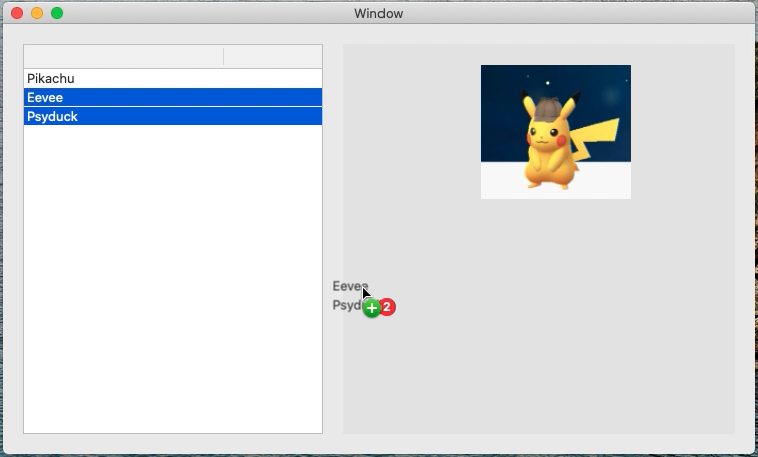

# DragAndDrop_TableToView
This is a minimum sample code to drag and drop files from NSTable to NSView object in macOS.

[movie in YouTube](https://youtu.be/hwwA57p0iRQ)

macOS Catalina 10.15.2  
Swift 5.1.3  
Xcode 11.3.1  
